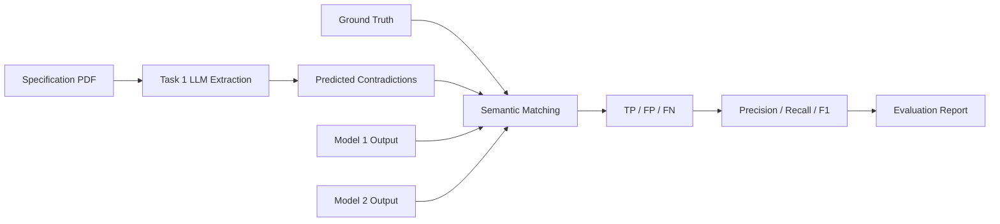

<div align="center">

# 🧠 LLM Quality Evaluation
### Contract Contradiction Detection in Construction Specifications

<p>
  
  
  
  
</p>

**A compact evaluation pipeline for detecting and benchmarking contradictions in a construction specification.**

</div>

---

## 📌 Overview

This project evaluates how reliably LLM-generated outputs identify contradictions in a waterproofing specification.

The benchmark contains **10 known contradictions** across four categories:

| Category | Examples |
|---|---|
| 🛠️ Technical | Thickness, strength, spacing, product requirements |
| 👷 Responsibility | Which party is responsible for a task |
| ⚖️ Liability | Warranty, cost allocation, defect liability |
| ⏱️ Schedule | Curing time, waiting periods, application windows |

The project contains two parts:

**Task 1** — Extract contradictions from the specification using a single-pass LLM approach.  
**Task 2** — Compare model outputs against the ground truth using semantic similarity and evaluation metrics.

---

## 🧩 Project Workflow



---

## 🤖 Task 1 — Contradiction Extraction

Task 1 uses a **single-pass LLM approach**.

The full specification is extracted from the PDF and sent to the model in one request. The model is asked to identify contradictions in:

- Technical requirements
- Responsibility
- Liability
- Schedule

The output is stored in structured JSON:

```json
{
  "Statement1": "First conflicting statement",
  "Statement2": "Second conflicting statement",
  "Reasoning": "Why the two statements conflict"
}
```

### Why single-pass?

It is simple to implement, inexpensive, easy to reproduce, and useful as a baseline.

Its main limitation is that the model must analyse the entire document at once, so subtle contradictions may be missed.

---

## 📊 Task 2 — Evaluation Method

Exact text matching is too strict because two models may describe the same contradiction using different wording.

Instead, each contradiction is represented as:

```text
Statement1 + Statement2 + Reasoning
```

The combined text is converted into embeddings using:

`all-MiniLM-L6-v2`

Cosine similarity is then used to compare predictions against the ground truth.

### Matching rule

A prediction is counted as a match when:

```text
cosine similarity >= 0.53
```

Each ground-truth contradiction can only be matched once.

---

## 📐 Metrics

| Metric | Meaning |
|---|---|
| **Precision** | Of all contradictions predicted, how many were correct? |
| **Recall** | Of all real contradictions, how many were found? |
| **F1-score** | Balance between Precision and Recall |

```text
Precision = TP / (TP + FP)

Recall = TP / (TP + FN)

F1 = 2 × Precision × Recall / (Precision + Recall)
```

---

## 🏆 Results

| Model | TP | FP | FN | Precision | Recall | F1 |
|:--|--:|--:|--:|--:|--:|--:|
| 🟢 **My Task 1** | **8** | **0** | **2** | **1.00** | **0.80** | **0.89** |
| 🔵 Model 1 | 8 | 2 | 2 | 0.80 | 0.80 | 0.80 |
| 🟠 Model 2 | 6 | 4 | 4 | 0.60 | 0.60 | 0.60 |

> **Key observation:** My Task 1 model found 8 of the 10 ground-truth contradictions and produced no false positives.

---

## ⚙️ Setup

```bash
python3 -m venv .venv
source .venv/bin/activate
pip install -r requirements.txt
```

Create a `.env` file:

```text
OPENAI_API_KEY=your_api_key_here
```

> `.env` is excluded from Git through `.gitignore`.

---

## ▶️ Run the Project

```bash
python3 task1_extract.py
python3 evaluate.py
python3 evaluate_task1.py
```

---

## 📄 Reports

| File | Purpose |
|---|---|
| `report.txt` | Plain-text evaluation summary |
| `report.html` | Styled visual report |

---

## ⚠️ Limitations

This benchmark contains only **10 contradictions from one document**.

The results may also change depending on the embedding model, similarity threshold, wording of predictions, and the LLM used for Task 1.

For production use, the same evaluation should be repeated on a larger set of manually reviewed documents, with threshold tuning performed on a separate validation set.

---

<div align="center">

## ✅ Summary

| Model | Precision | Recall | F1 |
|---|---:|---:|---:|
| **My Task 1** | **1.00** | **0.80** | **0.89** |
| Model 1 | 0.80 | 0.80 | 0.80 |
| Model 2 | 0.60 | 0.60 | 0.60 |

**Best observed F1 on this benchmark: 0.89**

`PDF → LLM → Semantic Matching → Precision / Recall / F1`

</div>
